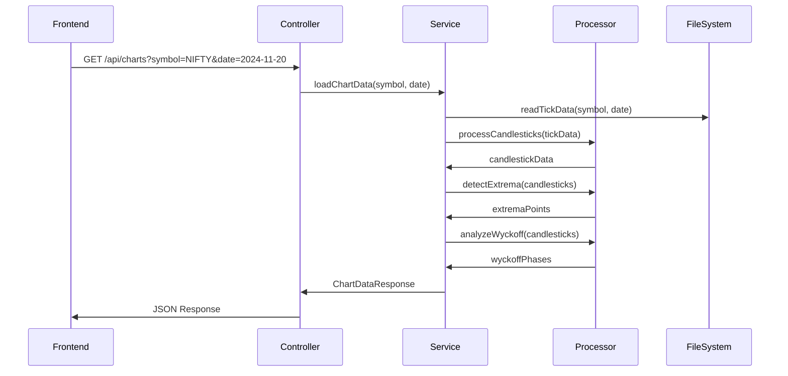
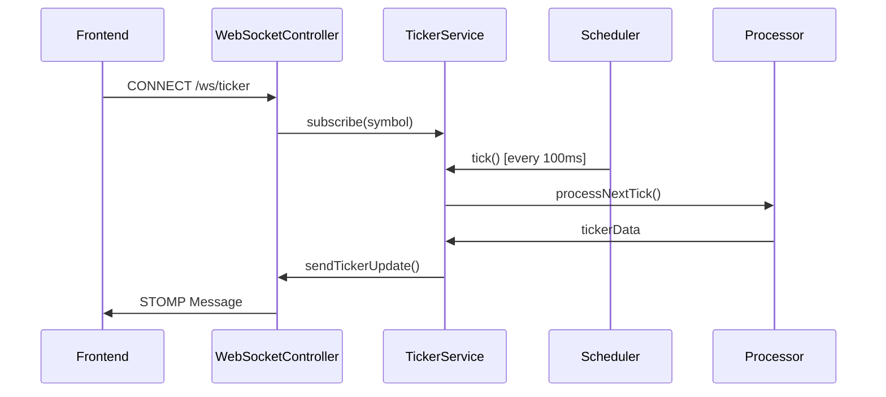
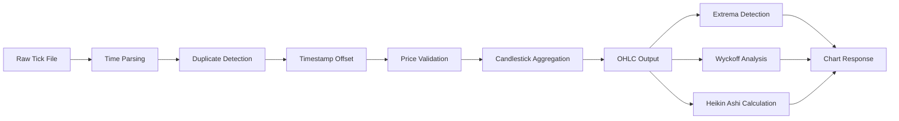
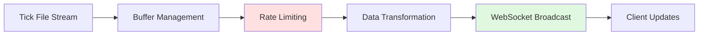

# Backend Architecture Documentation

## Overview
The ChartsSimulator backend is built with Spring Boot 4.0.0, following a clean, layered architecture with SOLID principles. It provides both REST APIs and WebSocket endpoints for real-time financial data streaming.

## Architecture Diagram

```mermaid
graph TB
    subgraph "External Layer"
        A[Frontend Clients]
        B[Mobile Apps]
        C[External APIs]
    end

    subgraph "Presentation Layer"
        D[ChartsSimulatorApplication]
        D --> E[REST Controllers]
        D --> F[WebSocket Controllers]
        D --> G[Global Exception Handler]

        E --> H[ChartsController]
        E --> I[TickerController]
        E --> J[HealthController]

        F --> K[TickerWebSocketController]
        F --> L[ChartsWebSocketController]
    end

    subgraph "Configuration Layer"
        M[WebSocketConfig]
        N[CorsConfig]
        O[SecurityConfig]
        P[ConfigurationProperties]
        P --> Q[WebSocketProperties]
        P --> R[TickerProperties]
        P --> S[ApplicationProperties]
    end

    subgraph "Service Layer - Business Logic"
        T[ChartsService]
        U[TickerService]
        V[ExtremaService]
        W[WyckoffService]
        X[DataProcessingService]
        Y[FileProcessingService]
    end

    subgraph "Data Processing Engine"
        Z[CandlestickProcessor]
        AA[HeikinAshiProcessor]
        BB[ExtremaDetector]
        CC[WyckoffAnalyzer]
        DD[TimeSeriesProcessor]
        EE[DuplicationHandler]
    end

    subgraph "Model Layer"
        FF[DTO Records]
        FF --> GG[CandlestickData]
        FF --> HH[TickerData]
        FF --> II[ExtremaPoint]
        FF --> JJ[WyckoffPhase]

        KK[Entity Classes]
        KK --> LL[TimeSeriesData]
        KK --> MM[MarketData]
    end

    subgraph "Utility Layer"
        NN[TimeUtils]
        OO[MathUtils]
        PP[DateTimeUtils]
        QQ[ValidationUtils]
    end

    subgraph "Infrastructure Layer"
        RR[File System]
        SS[WebSocket STOMP]
        TT[Scheduler]
        UU[Health Monitoring]
    end

    A --> H
    A --> K
    B --> I
    C --> Y

    H --> T
    I --> U
    K --> U
    L --> T

    T --> Z
    T --> BB
    T --> CC
    U --> DD
    U --> EE

    T --> GG
    T --> II
    T --> JJ
    U --> HH

    Z --> NN
    BB --> OO
    CC --> PP
    DD --> QQ

    T --> RR
    U --> SS
    K --> SS

    M --> SS
    N --> H
    O --> G

    style T fill:#e1f5fe
    style U fill:#e1f5fe
    style V fill:#e1f5fe
    style W fill:#e1f5fe
    style Z fill:#f3e5f5
    style DD fill:#f3e5f5
```



## Layered Architecture

### 1. **Presentation Layer**
```
├── controllers/
│   ├── ChartsController.java - REST API for chart data
│   ├── TickerController.java - REST API for ticker data
│   ├── TickerWebSocketController.java - Real-time ticker streaming
│   └── HealthController.java - System health endpoints
├── config/
│   ├── WebSocketConfig.java - STOMP configuration
│   ├── CorsConfig.java - Cross-origin setup
│   └── GlobalExceptionHandler.java - Centralized error handling
```

### 2. **Service Layer (Business Logic)**
```
├── services/
│   ├── ChartsService.java - Chart data orchestration
│   ├── TickerService.java - Real-time data streaming
│   ├── ExtremaService.java - Maxima/minima detection
│   ├── WyckoffService.java - Phase analysis
│   └── DataProcessingService.java - File processing coordination
```

### 3. **Data Processing Engine**
```
├── processors/
│   ├── CandlestickProcessor.java - OHLC data processing
│   ├── HeikinAshiProcessor.java - Heikin Ashi calculations
│   ├── ExtremaDetector.java - Peak/valley detection algorithms
│   ├── WyckoffAnalyzer.java - Market phase classification
│   └── TimeSeriesProcessor.java - Time-based data handling
```

### 4. **Configuration Management**
```java
@ConfigurationProperties("app.websocket")
public record WebSocketProperties(
    String endpoint,
    String allowedOrigins,
    int messageDelay,
    int tickerDelay
) {}

@ConfigurationProperties("app.ticker")
public record TickerProperties(
    boolean deduplicateTimestamps,
    long duplicateOffsetMs
) {}
```

## Data Flow Architecture

### 1. **REST API Flow**


### 2. **WebSocket Flow**


## Service Architecture Patterns

### 1. **Dependency Injection**
```java
@Service
@RequiredArgsConstructor
public class ChartsService {
    private final ExtremaService extremaService;
    private final WyckoffService wyckoffService;
    private final DataProcessingService dataProcessingService;

    // Business logic using injected services
}
```

### 2. **Configuration-Driven**
```java
@Component
@ConfigurationProperties("app.processing")
public record ProcessingConfig(
    int batchSize,
    Duration timeout,
    boolean enableCaching
) {}
```

### 3. **Exception Handling**
```java
@ControllerAdvice
public class GlobalExceptionHandler {
    @ExceptionHandler(DataNotFoundException.class)
    public ResponseEntity<ErrorResponse> handleDataNotFound(DataNotFoundException ex) {
        return ResponseEntity.status(HttpStatus.NOT_FOUND)
            .body(new ErrorResponse(ex.getMessage(), ex.getContext()));
    }
}
```

## Data Processing Pipeline

### 1. **Tick Data Processing**


### 2. **Real-time Streaming**


## Key Features

### 1. **Time Management**
- **Timezone**: Consistent `Asia/Kolkata` timezone
- **Deduplication**: Automatic timestamp offset for duplicates (600ms)
- **Time Filtering**: Configurable market hours (9:20 AM - 1:20 PM)

### 2. **Data Processing**
- **Batch Processing**: Efficient file processing with configurable batch sizes
- **Real-time Streaming**: WebSocket-based live data with exponential backoff
- **Multiple Chart Types**: Candlestick, Heikin Ashi, Combined views
- **Technical Analysis**: Extrema detection, Wyckoff phase analysis

### 3. **Configuration Management**
```yaml
app:
  websocket:
    endpoint: "/ws"
    allowed-origins: "*"
    message-delay: 100
    ticker-delay: 100
  ticker:
    deduplicate-timestamps: true
    duplicate-offset-ms: 600
  processing:
    batch-size: 1000
    enable-caching: true
```

### 4. **Health Monitoring**
```java
@RestController
public class HealthController {
    @GetMapping("/api/health")
    public ResponseEntity<HealthResponse> health() {
        return ResponseEntity.ok(HealthResponse.builder()
            .status("UP")
            .timestamp(Instant.now())
            .services(getServiceStatuses())
            .build());
    }
}
```

## Integration Patterns

### 1. **Frontend Integration**
- **Single Maven Build**: Frontend packaged into Spring Boot resources
- **Static Resource Serving**: Next.js build served by Spring Boot
- **API Gateway Pattern**: All requests routed through Spring Boot

### 2. **WebSocket Integration**
```java
@Configuration
@EnableWebSocketMessageBroker
public class WebSocketConfig implements WebSocketMessageBrokerConfigurer {

    @Override
    public void configureMessageBroker(MessageBrokerRegistry config) {
        config.enableSimpleBroker("/topic");
        config.setApplicationDestinationPrefixes("/app");
    }

    @Override
    public void registerStompEndpoints(StompEndpointRegistry registry) {
        registry.addEndpoint("/ws")
                .setAllowedOriginPatterns("*")
                .withSockJS();
    }
}
```

### 3. **Error Handling Strategy**
```java
// Domain-specific exceptions
public class DataNotFoundException extends RuntimeException {
    private final Map<String, Object> context;

    public DataNotFoundException(String message, Map<String, Object> context) {
        super(message);
        this.context = context;
    }
}

// Structured error responses
public record ErrorResponse(
    String message,
    String timestamp,
    Map<String, Object> context
) {}
```

## Performance Optimizations

### 1. **Memory Management**
- Streaming file processing to handle large datasets
- Efficient data structures for time-series operations
- Garbage collection optimization for real-time streaming

### 2. **Caching Strategy**
- Chart data caching for frequently accessed symbols
- WebSocket connection pooling
- File system caching for processed data

### 3. **Scalability Features**
- Configurable thread pools for processing
- Async processing for non-blocking operations
- Rate limiting for API endpoints

## Security & Production Features

### 1. **Security Configuration**
- CORS configuration for cross-origin requests
- Rate limiting middleware
- Input validation and sanitization
- Secure WebSocket connections

### 2. **Monitoring & Observability**
- Health check endpoints
- Structured logging with correlation IDs
- Metrics collection for performance monitoring
- Error tracking and alerting

### 3. **Deployment**
- Single JAR deployment with embedded frontend
- Docker containerization support
- Environment-specific configuration
- Graceful shutdown handling