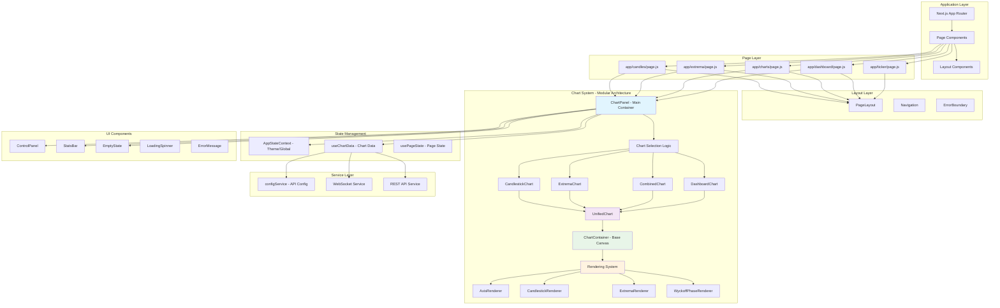

# Frontend Architecture Documentation

## Overview
The ChartsSimulator frontend follows a modular, component-based architecture built with Next.js 15, React 18, and TypeScript. The architecture emphasizes reusability, maintainability, and separation of concerns.

## Architecture Diagram



## Component Hierarchy

### 1. Page Components (Simplified with ChartPanel)
```
├── app/
│   ├── candles/page.js (19 lines) - Uses ChartPanel
│   ├── extrema/page.js (19 lines) - Uses ChartPanel
│   ├── charts/page.js (19 lines) - Uses ChartPanel
│   └── dashboard/page.js - Multi-chart layout
```

### 2. Chart System Architecture
```
ChartPanel (Main Container)
├── Controls Integration
│   ├── ControlPanel
│   ├── StatsBar
│   └── Theme/Mode Toggles
├── Chart Type Selection
│   ├── CandlestickChart
│   ├── ExtremaChart
│   ├── CombinedChart
│   └── DashboardChart
└── Unified Rendering
    ├── UnifiedChart (Configuration Hub)
    ├── ChartContainer (Canvas Management)
    └── Renderer System
        ├── AxisRenderer
        ├── CandlestickRenderer
        ├── ExtremaRenderer
        └── WyckoffPhaseRenderer
```

## Key Architectural Principles

### 1. **Modular Design**
- Each renderer is a pure function
- Components are highly reusable
- Clear separation of concerns

### 2. **Configuration-Driven**
- ChartPanel accepts configuration props
- UnifiedChart handles feature toggles
- Easy to create new chart combinations

### 3. **Single Responsibility**
- ChartContainer: Canvas and viewport management
- UnifiedChart: Chart coordination and rendering
- ChartPanel: UI integration and data flow
- Renderers: Specific drawing logic

### 4. **Data Flow**
```
Page → ChartPanel → useChartData → API/WebSocket → UnifiedChart → Renderers → Canvas
```

## Component Reuse Patterns

### 1. **ChartPanel Configurations**
```javascript
// Full-featured page
<ChartPanel
  chartType="extrema"
  showControls={true}
  showStats={true}
  showModeToggle={true}
/>

// Dashboard mini-chart
<ChartPanel
  chartType="dashboard"
  showControls={false}
  showStats={false}
  showModeToggle={false}
/>
```

### 2. **Chart Type Presets**
```javascript
// Pre-configured chart types
export const ExtremaChart = (props) => (
  <UnifiedChart showExtrema={true} showWyckoffPhases={true} {...props} />
);

export const DashboardChart = (props) => (
  <UnifiedChart enableInteraction={false} showAxes={false} {...props} />
);
```

## Technology Stack

### Core Framework
- **Next.js 15**: App Router, SSR/SSG
- **React 18**: Hooks, Context, Suspense
- **JavaScript**: Pure JS with ESLint/Prettier

### Styling & UI
- **TailwindCSS**: Utility-first CSS
- **Theme System**: Dark/Light mode support
- **Responsive Design**: Mobile-first approach

### Data & State
- **React Context**: Global state management
- **Custom Hooks**: Data fetching and management
- **WebSocket**: Real-time data streaming
- **REST API**: Instant data loading

### Development Tools
- **ESLint**: Code quality enforcement
- **Prettier**: Code formatting
- **Playwright**: E2E testing
- **Hot Reload**: Fast development cycle

## Performance Optimizations

### 1. **Canvas Rendering**
- Device pixel ratio handling
- Efficient re-rendering strategies
- Viewport-based rendering

### 2. **Component Loading**
- Dynamic imports for chart components
- Lazy loading for heavy components
- Code splitting optimization

### 3. **Memory Management**
- Proper cleanup of event listeners
- Canvas context management
- WebSocket connection pooling

## Scalability Features

### 1. **Extensible Renderer System**
```javascript
// Easy to add new chart types
export const NewChartType = (props) => (
  <UnifiedChart showNewFeature={true} {...props} />
);
```

### 2. **Configuration Flexibility**
- Chart features can be toggled independently
- UI components can be shown/hidden
- Themes and modes are configurable

### 3. **Dashboard Integration**
- ChartPanel designed for multi-chart layouts
- Minimal configuration for dashboard use
- Responsive grid system support

## Migration Benefits

### Before Refactoring
- 3 separate page implementations (132, 111, 107 lines)
- Duplicate chart logic across pages
- Manual fixes needed for each page
- No dashboard reusability

### After Refactoring
- 3 pages using ChartPanel (19 lines each)
- Single source of truth for chart logic
- Automatic fixes apply to all pages
- Ready for dashboard integration (4-chart grid)
- 85% code reduction in page components