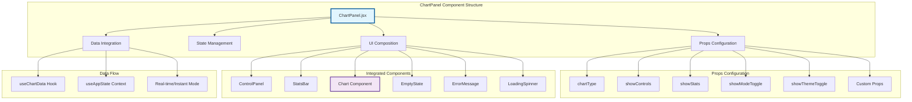
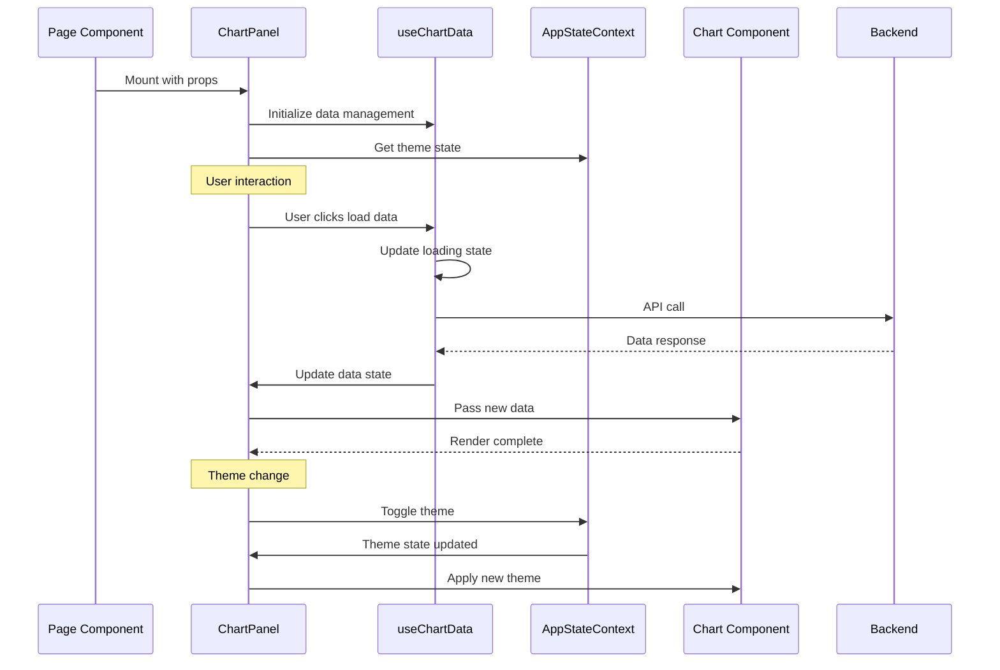

# ChartPanel Component Integration Guide

## Overview
The ChartPanel component is the centerpiece of the ChartsSimulator's modular architecture. It provides a fully configurable, reusable chart interface that can be adapted for different use cases while maintaining consistent functionality and appearance.

## Component Architecture



## Configuration Options

### Complete Props Interface
```javascript
const ChartPanel = ({
  // Chart Configuration
  chartType = 'candlestick',        // 'extrema' | 'candlestick' | 'combined' | 'dashboard'

  // UI Visibility Controls
  showControls = true,              // Show/hide control panel
  showStats = true,                 // Show/hide stats bar
  showModeToggle = true,            // Show/hide real-time/instant toggle
  showThemeToggle = true,           // Show/hide theme toggle

  // Customization Options
  title = null,                     // Custom title (auto-generated if null)
  emptyIcon = null,                 // Custom empty state icon
  emptyTitle = null,                // Custom empty state title
  emptyDescription = null,          // Custom empty state description
  className = '',                   // Additional CSS classes
  style = {}                        // Additional inline styles
}) => {
  // Component implementation
};
```

### Chart Type Configurations
```javascript
const chartConfigs = {
  extrema: {
    component: ExtremaChart,
    defaultTitle: 'Extrema Analysis',
    defaultEmptyIcon: '📈',
    statsGenerator: (data) => [
      { label: 'Candles', value: data.candles?.length || 0 },
      { label: 'Maxima', value: data.maxima?.length || 0 },
      { label: 'Minima', value: data.minima?.length || 0 }
    ]
  },
  candlestick: {
    component: CandlestickChart,
    defaultTitle: 'Candlestick Chart',
    defaultEmptyIcon: '📊',
    statsGenerator: (data) => [
      { label: 'Candles', value: data.candles?.length || 0 },
      { label: 'Current Phase', value: data.currentPhase || 'Unknown' }
    ]
  },
  combined: {
    component: CombinedChart,
    defaultTitle: 'Combined Chart',
    defaultEmptyIcon: '📈',
    statsGenerator: (data) => [
      { label: 'Candles', value: data.candles?.length || 0 },
      { label: 'Heikin Ashi', value: data.heikinAshi?.length || 0 }
    ]
  },
  dashboard: {
    component: DashboardChart,
    defaultTitle: 'Dashboard Chart',
    defaultEmptyIcon: '📋',
    statsGenerator: (data) => [
      { label: 'Candles', value: data.candles?.length || 0 }
    ]
  }
};
```

## Integration Patterns

### 1. **Standard Page Integration**
```javascript
// app/candles/page.js - Full-featured chart page
import { ChartPanel } from '@/components/charts';

export default function CandlesPage() {
  return (
    <PageLayout>
      <ChartPanel
        chartType="candlestick"
        showControls={true}
        showStats={true}
        showModeToggle={false}
        showThemeToggle={true}
      />
    </PageLayout>
  );
}
```

### 2. **Dashboard Integration**
```javascript
// Dashboard with multiple mini-charts
export default function DashboardPage() {
  return (
    <div className="grid grid-cols-2 gap-4">
      <ChartPanel
        chartType="dashboard"
        showControls={false}
        showStats={false}
        showModeToggle={false}
        showThemeToggle={false}
        className="h-64"
      />
      <ChartPanel
        chartType="dashboard"
        showControls={false}
        showStats={false}
        showModeToggle={false}
        showThemeToggle={false}
        className="h-64"
      />
      {/* Additional chart panels */}
    </div>
  );
}
```

### 3. **Modal/Dialog Integration**
```javascript
// Chart in a modal dialog
function ChartModal({ isOpen, onClose }) {
  return (
    <Modal isOpen={isOpen} onClose={onClose}>
      <ChartPanel
        chartType="extrema"
        showControls={false}
        showThemeToggle={false}
        className="h-96"
        style={{ maxWidth: '600px' }}
      />
    </Modal>
  );
}
```

### 4. **Embedded Widget Integration**
```javascript
// Small embedded chart widget
function ChartWidget({ symbol, compact = false }) {
  return (
    <div className="chart-widget">
      <ChartPanel
        chartType="candlestick"
        showControls={!compact}
        showStats={!compact}
        showModeToggle={false}
        showThemeToggle={false}
        title={`${symbol} Chart`}
        className={compact ? "h-32" : "h-64"}
      />
    </div>
  );
}
```

## Data Management Integration

### useChartData Hook Integration
```javascript
// ChartPanel automatically integrates with useChartData
const ChartPanel = ({ chartType, ...props }) => {
  const {
    isRealTime,
    realTimeData,
    realTimeLoading,
    realTimeError,
    instantData,
    instantLoading,
    instantError,
    loadData,
    toggleMode,
    clearErrors,
  } = useChartData(); // Automatic data management

  // Data flows automatically to chart components
  const currentData = isRealTime ? realTimeData : instantData;
  const isLoading = isRealTime ? realTimeLoading : instantLoading;
  const error = isRealTime ? realTimeError : instantError;

  // Rest of component logic
};
```

### Custom Data Source Integration
```javascript
// For special use cases with custom data
function CustomChartPanel({ customData, ...props }) {
  const [localData, setLocalData] = useState(customData);

  return (
    <ChartPanel
      {...props}
      // Override internal data management if needed
      data={localData}
      onDataChange={setLocalData}
    />
  );
}
```

## Styling and Theming

### Theme Integration
```javascript
// ChartPanel automatically integrates with theme system
const ChartPanel = ({ showThemeToggle, ...props }) => {
  const { theme, toggleTheme } = useAppState();

  return (
    <div className="chart-panel" data-theme={theme}>
      {/* Theme automatically applied to all child components */}
      <ControlPanel
        theme={theme}
        onThemeToggle={showThemeToggle ? toggleTheme : undefined}
      />
      <ChartComponent theme={theme} />
    </div>
  );
};
```

### Custom Styling
```javascript
// Custom styling options
<ChartPanel
  chartType="extrema"
  className="border-2 border-blue-500 rounded-lg"
  style={{
    background: 'linear-gradient(to bottom, #1a1a1a, #2a2a2a)',
    boxShadow: '0 4px 6px rgba(0, 0, 0, 0.1)'
  }}
/>
```

## State Management Flow



## Error Handling Integration

### Automatic Error Management
```javascript
const ChartPanel = () => {
  const { error, clearErrors } = useChartData();

  return (
    <div>
      {/* Automatic error display */}
      {error && (
        <ErrorMessage
          message={error}
          onDismiss={clearErrors}
          theme={theme}
        />
      )}

      {/* Chart content */}
      <ChartContent />
    </div>
  );
};
```

### Custom Error Handling
```javascript
function ChartPanelWithCustomErrors({ onError, ...props }) {
  const handleError = (error) => {
    console.error('Chart error:', error);
    onError?.(error);
    // Custom error handling logic
  };

  return (
    <ChartPanel
      {...props}
      onError={handleError}
    />
  );
}
```

## Loading State Management

### Automatic Loading States
```javascript
const ChartPanel = () => {
  const { isLoading } = useChartData();

  return (
    <div>
      {isLoading ? (
        <LoadingSpinner message="Loading chart data..." />
      ) : (
        <ChartContent />
      )}
    </div>
  );
};
```

### Custom Loading Indicators
```javascript
<ChartPanel
  chartType="extrema"
  loadingComponent={<CustomLoadingSpinner />}
  loadingMessage="Analyzing extrema patterns..."
/>
```

## Advanced Integration Patterns

### 1. **Multi-Chart Synchronization**
```javascript
function SynchronizedCharts() {
  const [selectedSymbol, setSelectedSymbol] = useState('NIFTY');
  const [selectedDate, setSelectedDate] = useState('2024-11-20');

  return (
    <div className="grid grid-cols-2 gap-4">
      <ChartPanel
        chartType="candlestick"
        symbol={selectedSymbol}
        date={selectedDate}
        onSymbolChange={setSelectedSymbol}
      />
      <ChartPanel
        chartType="extrema"
        symbol={selectedSymbol}
        date={selectedDate}
        showControls={false} // Only one control panel needed
      />
    </div>
  );
}
```

### 2. **Progressive Enhancement**
```javascript
function ProgressiveChartPanel({ features = [] }) {
  const baseConfig = {
    chartType: "candlestick",
    showControls: true,
    showStats: false,
    showModeToggle: false
  };

  const enhancedConfig = features.reduce((config, feature) => {
    switch (feature) {
      case 'stats':
        return { ...config, showStats: true };
      case 'realtime':
        return { ...config, showModeToggle: true };
      case 'themes':
        return { ...config, showThemeToggle: true };
      default:
        return config;
    }
  }, baseConfig);

  return <ChartPanel {...enhancedConfig} />;
}

// Usage
<ProgressiveChartPanel features={['stats', 'realtime']} />
```

### 3. **Conditional Feature Loading**
```javascript
function AdaptiveChartPanel({ userRole, permissions }) {
  const config = {
    chartType: "extrema",
    showControls: permissions.includes('chart_controls'),
    showStats: permissions.includes('chart_stats'),
    showModeToggle: userRole === 'premium',
    showThemeToggle: true
  };

  return <ChartPanel {...config} />;
}
```

## Performance Optimizations

### 1. **Lazy Loading**
```javascript
import { lazy, Suspense } from 'react';

const LazyChartPanel = lazy(() => import('@/components/charts/ChartPanel'));

function OptimizedChartPage() {
  return (
    <Suspense fallback={<LoadingSpinner />}>
      <LazyChartPanel chartType="extrema" />
    </Suspense>
  );
}
```

### 2. **Memoization**
```javascript
import { memo } from 'react';

const MemoizedChartPanel = memo(ChartPanel, (prevProps, nextProps) => {
  return (
    prevProps.chartType === nextProps.chartType &&
    prevProps.showControls === nextProps.showControls &&
    prevProps.data === nextProps.data
  );
});
```

### 3. **Virtual Scrolling for Dashboard**
```javascript
function VirtualizedDashboard({ charts }) {
  return (
    <VirtualList
      items={charts}
      renderItem={({ chartConfig }) => (
        <ChartPanel
          {...chartConfig}
          chartType="dashboard"
          showControls={false}
        />
      )}
    />
  );
}
```

## Migration Guide

### From Legacy Chart Components
```javascript
// Before (Legacy)
function OldCandlesPage() {
  const [data, setData] = useState(null);
  const [loading, setLoading] = useState(false);
  const [error, setError] = useState(null);

  // 100+ lines of logic

  return (
    <PageLayout>
      <ControlPanel onSubmit={handleLoad} />
      {data ? <CandleChart data={data} /> : <EmptyState />}
    </PageLayout>
  );
}

// After (ChartPanel)
function NewCandlesPage() {
  return (
    <PageLayout>
      <ChartPanel chartType="candlestick" />
    </PageLayout>
  );
}
```

## Best Practices

### 1. **Configuration Over Customization**
```javascript
// ✅ Good - Use props for configuration
<ChartPanel chartType="extrema" showModeToggle={false} />

// ❌ Avoid - Don't customize by modifying the component
```

### 2. **Consistent Data Flow**
```javascript
// ✅ Good - Let ChartPanel manage data
<ChartPanel chartType="candlestick" />

// ⚠️ Use sparingly - Custom data only when necessary
<ChartPanel data={customData} />
```

### 3. **Theme Integration**
```javascript
// ✅ Good - Use built-in theme support
<ChartPanel showThemeToggle={true} />

// ❌ Avoid - Don't override theme manually
```

### 4. **Performance Considerations**
```javascript
// ✅ Good - Stable configuration objects
const chartConfig = useMemo(() => ({
  chartType: "extrema",
  showControls: true
}), []);

<ChartPanel {...chartConfig} />

// ❌ Avoid - New objects on every render
<ChartPanel chartType="extrema" showControls={true} />
```

This comprehensive integration guide ensures that ChartPanel can be used effectively across all scenarios while maintaining consistency, performance, and maintainability.