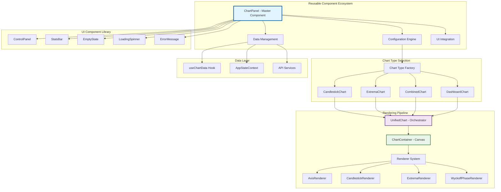
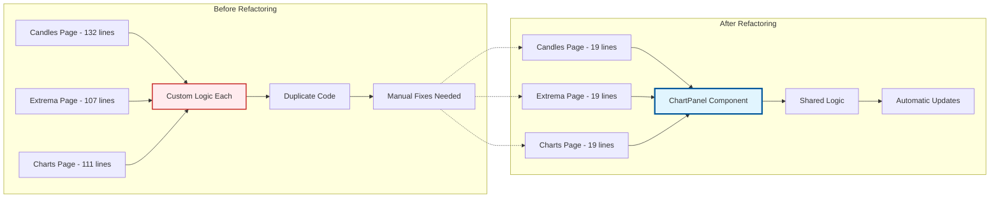
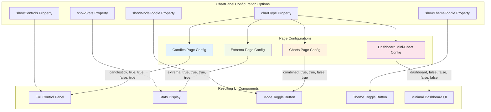
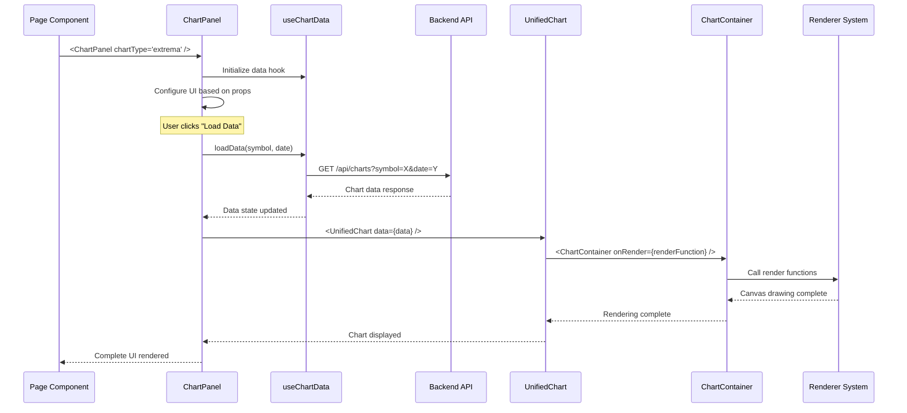
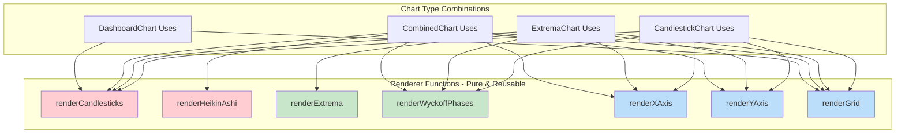
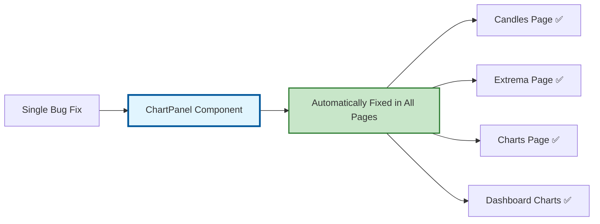
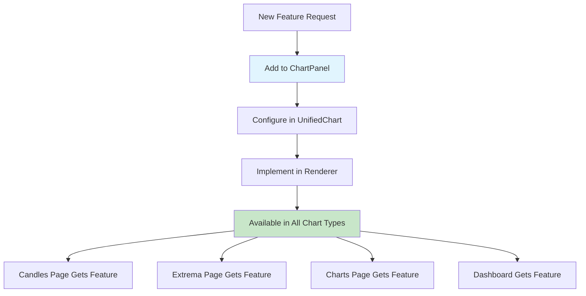
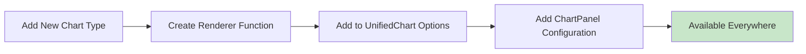
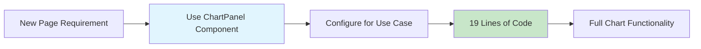

# Component Reuse Flow Diagrams

## Overview
This document illustrates how components are reused across different pages and contexts in the ChartsSimulator application, focusing on the modular chart architecture.

## Component Reuse Architecture



## Page Integration Flow



## ChartPanel Configuration Matrix



## Data Flow Through Reusable Components



## Renderer System Reuse Pattern



## Dashboard Integration Pattern

```mermaid
graph TB
    subgraph "Dashboard Page Layout"
        A[Dashboard Container]
        A --> B[Header Controls]
        A --> C[4-Chart Grid]
    end

    subgraph "Chart Grid Implementation"
        C --> D[Chart Slot 1]
        C --> E[Chart Slot 2]
        C --> F[Chart Slot 3]
        C --> G[Chart Slot 4]
    end

    subgraph "ChartPanel Integration"
        H[Minimal ChartPanel Config]
        H --> I[chartType: "dashboard"]
        H --> J[showControls: false]
        H --> K[showStats: false]
        H --> L[reduced size styling]
    end

    subgraph "Reused Components"
        M[Same UnifiedChart]
        M --> N[Same ChartContainer]
        M --> O[Same Renderers]
        M --> P[Optimized for small size]
    end

    D --> H
    E --> H
    F --> H
    G --> H

    H --> M

    style H fill:#e1f5fe,stroke:#01579b,stroke-width:3px
    style M fill:#f3e5f5,stroke:#4a148c,stroke-width:2px
```

## Component Reuse Benefits

### 1. **Code Reduction Statistics**
```
Before → After (Lines of Code)
├── Candles Page: 132 → 19 lines (85% reduction)
├── Extrema Page: 107 → 19 lines (82% reduction)
├── Charts Page: 111 → 19 lines (83% reduction)
└── Total Reduction: 350 → 57 lines (84% overall reduction)
```

### 2. **Maintenance Benefits**


### 3. **Feature Addition Flow**


## Implementation Patterns

### 1. **Configuration-Driven Reuse**
```javascript
// Single component, multiple configurations
const configurations = {
  candles: {
    chartType: "candlestick",
    showControls: true,
    showModeToggle: false
  },
  extrema: {
    chartType: "extrema",
    showControls: true,
    showModeToggle: true
  },
  dashboard: {
    chartType: "dashboard",
    showControls: false,
    showStats: false
  }
};
```

### 2. **Composition Pattern**
```javascript
// ChartPanel composes multiple reusable parts
<ChartPanel>
  {showControls && <ControlPanel />}
  {showStats && <StatsBar />}
  <ChartComponent />
  {error && <ErrorMessage />}
</ChartPanel>
```

### 3. **Hook-Based Data Sharing**
```javascript
// Consistent data management across all usages
const chartData = useChartData();
// Same hook used by all ChartPanel instances
```

## Future Extensibility

### 1. **New Chart Types**


### 2. **New Page Types**


This modular, reusable architecture ensures that:
- ✅ No duplicate code across chart pages
- ✅ Single source of truth for chart logic
- ✅ Easy dashboard integration
- ✅ Automatic feature propagation
- ✅ Consistent user experience
- ✅ Minimal development effort for new features